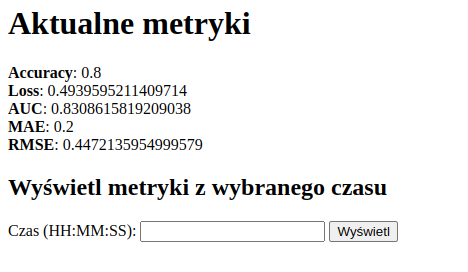
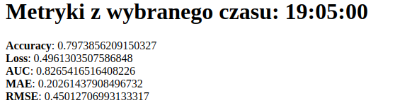

## Zaawansowane techniki programowania - Projekt

#### Skład zespołu

* Gabriela Zapała
* Konrad Synowiec
* Karol Waligóra

#### Link do githuba

[`https://github.com/gzapalka/ztp`](https://github.com/gzapalka/ztp)

#### Uruchomienie

W celu uruchomienia projektu należy z poziomu linii komend wywołać następujące polecenia

```
$ docker-compose build
$ docker-compose up
```

Następujące kontenery powinny zostać uruchomione:

* `kafka`
* `zookeeper`
* `producer`
* `logistic-regression-client`
* `web`

#### Opis projektu

Projekt obejmuje implementację modelu regresji logistycznej, który na podstawie danych dotyczących różnych parametrów 
zdrowotnych i wyników badań umożliwia przewidywanie, czy dany pacjent jest chory na cukrzycę. 
Model trenowany i ewaluowany jest na bieżąco na bazie danych strumieniowych. 
W ramach projektu zaimplementowana została prosta aplikacja webowa umożliwiająca przegląd metryk modelu.

#### Opis kontenerów

* `kafka` - kontener Apache Kafka przeznaczony do strumieniowego przesyłania danych.
* `zookeeper` - kontener przeznaczony do zarządzania Kafką.
* `producer` - serwis wysyłający dane do dwóch topiców Kafki - `train` i `predict`. Dane wysyłane na topic `train` to dane trenujące model, natomiast dane wysyłane na topic `predict` to dane generowane losowo, które ewaluują model.
* `logistic-regression-client` - kontener uruchamiający model regresji logistycznej oraz udostępniający API umożliwiające odczyt metryk, trenowanie i ewaluację modelu. Serwis odczytuje dane z topica `train` i `predict` oraz na ich podstawie trenuje model i przewiduje wyniki.
* `web` - aplikacja webowa umożliwiająca przegląd metryk modelu.

#### Opis modelu

Jako model uczenia maszynowego została wykorzystana implementacja regresji logistycznej dostarczana przez pakiet pyspark. Za obsługę modelu odpowiada klasa LogisticRegression, która podczas inicjalizacji pobiera dane na których przeprowadzany będzie trening z pliku csv.

Trening modelu wywoływany jest przez użycie metody `train`. Jako jej opcjonlany argument można podać dataframe z nowymi danymi, które zostaną załączone do zbioru. W metodzie `train` zbiór danych dzielony jest na część treningową i testową, przeprowadzany jest trening i generowane, a następnie zwracane są metryki.

Wytrenowy model może być użyty do klasyfikacji nieznanych danych za pomocą metody `predict`. Zwróci ona wynik klasyfikacji podanych jako parametr danych.

#### Metryki

**Accuracy**
* Opis metryki: Accuracy oblicza procent poprawnych predykcji modelu spośród wszystkich predykcji.
* Wartości: Wartości Accuracy mieszczą się w przedziale od 0 do 1, gdzie 1 oznacza idealną dokładność (100%) modelu. 
* Interpretacja: Wyższa wartość Accuracy wskazuje na lepszą zdolność modelu do przewidywania poprawnych wyników.

**Loss**
* Opis metryki: Loss jest miarą błędu pomiędzy predykcją modelu a rzeczywistymi wartościami.
* Wartości: Wartość Loss zależy od wybranej funkcji straty. W przypadku większości funkcji straty, niższa wartość oznacza mniejszy błąd predykcji.
* Interpretacja: Minimalizacja Loss jest celem modelu. Im mniejsza wartość straty, tym bardziej model odzwierciedla rzeczywistość i lepiej przewiduje oczekiwane wyniki.

**AUC**
* Opis metryki: Pole powierzchni pod krzywą ROC (Receiver Operating Characteristic) służy do oceny zdolności modelu do rozróżniania klas w problemach klasyfikacji binarnej.
* Wartości: Wartości AUC mieszczą się w przedziale od 0 do 1, gdzie 1 oznacza doskonałą zdolność rozróżniania klas.
* Interpretacja: Wyższa wartość AUC wskazuje na lepszą zdolność modelu do rozróżniania klas. Im bliżej wartości 1, tym lepsza wydajność modelu w klasyfikacji.

**MAE**
* Opis metryki: MAE to średnia wartość bezwzględna różnicy między predykcją modelu a rzeczywistymi wartościami.
* * Wartości: Wartości MAE są zależne od skali problemu i jednostek pomiaru, ale generalnie wyższa wartość oznacza większy błąd predykcji.
* Interpretacja: MAE mierzy przeciętny błąd predykcji modelu. Im niższa wartość MAE, tym lepiej model odwzorowuje rzeczywistość i ma mniejsze błędy predykcji.

**RMSE**
* Opis metryki: RMSE to pierwiastek z średniego błędu kwadratowego między predykcją a rzeczywistymi wartościami.
* Wartości: Wartości RMSE są zależne od skali problemu i jednostek pomiaru, ale generalnie wyższa wartość oznacza większy błąd predykcji.
* Interpretacja: RMSE mierzy przeciętny błąd predykcji modelu. Im niższa wartość RMSE, tym lepiej model odwzorowuje rzeczywistość i ma mniejsze błędy predykcji.

#### Wykorzystanie modelu

Udostępnionych zostało kilka funkcjonalności, które umożliwiają wykorzystanie modelu: 

REST API modelu: `http://localhost:8080`
  * `GET /predict/<string:values_to_evaluate>` - zwrócenie wyniku ewaluacji dla podanych danych np.:
      * `GET http://localhost:8080/predict/0,135,68,42,250,42.3,0.365,24`
  * `GET /train` - zrestartowanie modelu i wytrenowanie na początkowym zbiorze.
  * `GET /current_metrics` - zwrócenie metryk aktualnego modelu
  * `GET /metrics_of_time/<string:hour>` - zwrócenie metryk z podanej godziny np.:
      * `GET http://localhost:8080/metrics_of_time/12:00:00`
  * Prosta aplikacja webowa umożliwiająca przegląd metryk - `http://localhost:5000`. Metryki są pobierane z API modelu opisanego w powyższym punkcie.

    Zrzuty ekranu:

    
    
        
Model jest początkowo trenowany danymi pochodzącymi z pliku .csv, a następnie danymi strumieniowymi pochodzącymi z topica Kafki. Model jest trenowany danymi strumieniowymi co 10 sekund.
        
Poza ewaluacją poprzez API, ewaluacja modelu odbywa się na podstawie danych strumieniowych pochodzących z Kafki. Ewaluacja odbywa się co 10 sekund na podstawie danych generowanych losowo.


## Kod
`docker-compose.yaml`
```yaml
version: '2.1'

services:
  zookeeper:
    image: wurstmeister/zookeeper
    container_name: zookeeper
    ports:
      - "2181:2181"
  kafka:
    image: wurstmeister/kafka
    container_name: kafka
    ports:
      - "9092:9092"
    environment:
      KAFKA_ADVERTISED_HOST_NAME: kafka
      KAFKA_ZOOKEEPER_CONNECT: zookeeper:2181
    healthcheck:
      test: ["CMD", "kafka-topics.sh", "--list", "--bootstrap-server", "localhost:9092"]
      interval: 5s
      timeout: 10s
      retries: 5

  producer:
    build:
      context: ./streaming/
      dockerfile: Dockerfile
    environment:
      PYTHONUNBUFFERED: 1
      KAFKA_SERVER: "kafka:9092"
      TRAIN_TOPIC_NAME: "train"
      PREDICT_TOPIC_NAME: "predict"
    volumes:
      - ./streaming/:/app/
    depends_on:
      kafka:
        condition: service_healthy

  logistic-regression-client:
    build:
      context: ./model/
      dockerfile: Dockerfile
    environment:
      PYTHONUNBUFFERED: 1
      KAFKA_SERVER: "kafka:9092"
      TRAIN_TOPIC_NAME: "train"
      PREDICT_TOPIC_NAME: "predict"
    ports:
      - "8080:8080"
    volumes:
      - ./model/:/app/
    depends_on:
      kafka:
        condition: service_healthy

  web:
    build:
      context: ./web/
      dockerfile: Dockerfile
    ports:
      - "5000:5000"
    volumes:
      - ./web/:/app/
    depends_on:
      - logistic-regression-client
      - kafka
      - producer
```

`model/model.py`
```python
import time

import pandas
from pyspark.sql import SparkSession
from pyspark import SparkContext
from pyspark.ml.feature import StringIndexer, VectorAssembler
from pyspark.ml.classification import LogisticRegression
from pyspark.ml.evaluation import MulticlassClassificationEvaluator, RegressionEvaluator, BinaryClassificationEvaluator
import pandas as pd
import os
import sys

os.environ['PYSPARK_PYTHON'] = sys.executable
os.environ['PYSPARK_DRIVER_PYTHON'] = sys.executable

inputCols = ["Pregnancies", "Glucose", "BloodPressure", "SkinThickness", "Insulin", "BMI", "DiabetesPedigreeFunction",
             "Age"]
allCols = ["Pregnancies", "Glucose", "BloodPressure", "SkinThickness", "Insulin", "BMI", "DiabetesPedigreeFunction",
           "Age", "Outcome"]


class LogisticRegressionModel:
    _spark = None
    _data = None
    _logistic_regression_model = None
    _metrics_list = list()

    def __init__(self) -> None:
        self._spark = SparkSession.builder.appName("LogisticRegressionExample").getOrCreate()
        self._data = self._spark.read.format("csv").option("header", "true").option("inferSchema", "true").load(
            "diabetes.csv")

    def train(self, new_data: pandas.DataFrame = None):

        if new_data is not None:
            self._data = self._data.union(self._spark.createDataFrame(new_data))

        indexer = StringIndexer(inputCol="Outcome", outputCol="label")
        data = indexer.fit(self._data).transform(self._data)

        assembler = VectorAssembler(inputCols=inputCols, outputCol="features")
        transformed_data = assembler.transform(data).select("features", "label")

        train_data, test_data = transformed_data.randomSplit([0.7, 0.3], seed=123)

        self._logistic_regression_model = LogisticRegression(featuresCol="features", labelCol="label").fit(train_data)
        predictions = self._logistic_regression_model.transform(test_data)
        predictions.select("prediction", "label")

        loss = self._logistic_regression_model.summary.objectiveHistory[-1]
        accuracy = MulticlassClassificationEvaluator(labelCol="label", predictionCol="prediction",
                                                     metricName="accuracy") \
            .evaluate(predictions)
        auc = BinaryClassificationEvaluator(labelCol="label", rawPredictionCol="rawPrediction",
                                            metricName="areaUnderROC") \
            .evaluate(predictions)
        mae = RegressionEvaluator(labelCol="label", predictionCol="prediction", metricName="mae") \
            .evaluate(predictions)
        rmse = RegressionEvaluator(labelCol="label", predictionCol="prediction", metricName="rmse") \
            .evaluate(predictions)

        self._metrics_list.append([time.time(), {
            "Accuracy": accuracy,
            "Loss": loss,
            "AUC": auc,
            "MAE": mae,
            "RMSE": rmse
        }])

        return self._metrics_list[-1]

    def get_current_metrics(self):
        return self._metrics_list[-1]

    def get_metrics_of_time(self, metrics_time):
        for index, metrics in enumerate(self._metrics_list):
            if metrics[0] >= metrics_time:
                return self._metrics_list[index if index == 0 else index - 1]

    def predict(self, data: pandas.DataFrame) -> int:
        data = self._spark.createDataFrame(data)

        assembler = VectorAssembler(inputCols=inputCols, outputCol="features")
        data = assembler.transform(data).select("features")
        predictions = self._logistic_regression_model.transform(data)
        return predictions.select("prediction").collect()[0][0]
```

`model/client.py`
```python
import os
import time

from model import LogisticRegressionModel
import pandas as pd
from kafka.consumer import KafkaConsumer
from flask import Flask, render_template, request, jsonify
from datetime import datetime, date
from threading import Thread

app = Flask(__name__)

inputCols = ["Pregnancies", "Glucose", "BloodPressure", "SkinThickness", "Insulin", "BMI", "DiabetesPedigreeFunction",
             "Age"]
allCols = ["Pregnancies", "Glucose", "BloodPressure", "SkinThickness", "Insulin", "BMI", "DiabetesPedigreeFunction",
           "Age", "Outcome"]

lr = LogisticRegressionModel()
lr.train()


@app.route('/')
def index():
    return "Logistic Regression Model"


@app.route('/predict/<string:req>', methods=['GET'])
def predict(req):
    m_list = req.split(',')
    if len(m_list) != 8:
        return jsonify("Invalid request"), 409
    else:
        m_list = [float(x) for x in m_list]
        df = pd.DataFrame([m_list], columns=inputCols)
        return jsonify(lr.predict(df))


@app.route('/train', methods=['GET'])
def train():
    lr = LogisticRegressionModel()
    res = lr.train()
    return jsonify(res)


@app.route('/current_metrics', methods=['GET'])
def current_metrics():
    pass
    res = lr.get_current_metrics()
    return jsonify(res)


@app.route('/metrics_of_time/<string:req>', methods=['GET'])
def metrics_of_time(req):
    time_format = "%H:%M:%S"
    time_datetime = datetime.combine(date.today(), datetime.strptime(req, time_format).time())
    timestamp = time_datetime.timestamp()

    if timestamp > time.time():
        return jsonify('Model not evaluated at this time'), 409
    else:
        res = lr.get_metrics_of_time(timestamp)
        return jsonify(res)


def train_model_from_kafka():
    bootstrap_server = os.getenv('KAFKA_SERVER')
    train_topic = os.getenv('TRAIN_TOPIC_NAME')

    consumer = ConsumerWrapper(bootstrap_server, train_topic, "train_cg")

    try:
        for message in consumer.read_messages():
            m_list = message.split(',')
            m_list = [float(x) for x in m_list]
            print(f'Training : {m_list}')
            df = pd.DataFrame([m_list], columns=allCols)
            lr.train(df)
    except KeyboardInterrupt:
        pass
    finally:
        consumer.close()


def predict_model_from_kafka():
    bootstrap_server = os.getenv('KAFKA_SERVER')
    predict_topic = os.getenv('PREDICT_TOPIC_NAME')

    consumer = ConsumerWrapper(bootstrap_server, predict_topic, "predict_cg")

    try:
        for message in consumer.read_messages():
            m_list = message.split(',')
            m_list = [float(x) for x in m_list]
            df = pd.DataFrame([m_list], columns=inputCols)
            res = lr.predict(df)
            print(f'Predicting: {m_list} : {res}')
    except KeyboardInterrupt:
        pass
    finally:
        consumer.close()


class ConsumerWrapper:
    def __init__(self, bootstrap_server, topic, group_id) -> None:
        self.consumer = KafkaConsumer(
            topic,
            bootstrap_servers=bootstrap_server,
            group_id=group_id
        )

    def read_messages(self):
        for message in self.consumer:
            yield message.value.decode("utf-8")

    def close(self):
        self.consumer.close()


train_thread = Thread(target=train_model_from_kafka)
train_thread.start()

predict_thread = Thread(target=predict_model_from_kafka)
predict_thread.start()

if __name__ == '__main__':
    app.run(host='0.0.0.0', port=8080)
```

`model/Dockerfile`
```Dockerfile
FROM openjdk:17-slim

RUN mkdir /app

RUN apt update && \
    apt install python3 python3-pip -y

WORKDIR /app
COPY . /app

RUN pip3 install -r requirements.txt

CMD ["python3", "client.py"]
```

`streaming/producer.py`
```python
import os
import random
import time
from kafka.producer import KafkaProducer
from kafka.admin import KafkaAdminClient, NewTopic


class ProducerWrapper:
    def __init__(self, bootstrap_server) -> None:
        self.producer = KafkaProducer(bootstrap_servers=bootstrap_server)

    def send_message(self, topic, message) -> None:
        self.producer.send(topic, message.encode('utf-8'))
        self.producer.flush()

    def close(self) -> None:
        self.producer.close()


class KafkaAdminClientWrapper:
    def __init__(self, bootstrap_server) -> None:
        self.admin_client = KafkaAdminClient(bootstrap_servers=bootstrap_server)

    def create_topic(self, topic) -> None:
        topic_list = [NewTopic(name=topic, num_partitions=1, replication_factor=1)]
        self.admin_client.create_topics(new_topics=topic_list, validate_only=False)

    def topic_exists(self, topic) -> bool:
        topics = self.admin_client.list_topics()
        return topic in topics


class KafkaFileReader:
    def __init__(self, file_path) -> None:
        self.file_path = file_path

    def read_lines(self):
        with open(self.file_path, 'r') as file:
            skip_first_line = True
            for line in file:
                if skip_first_line:
                    skip_first_line = False
                    continue
                yield line.strip()


class KafkaMessageSender:
    def __init__(self, producer, train_topic, predict_topic) -> None:
        self.producer = producer
        self.train_topic = train_topic
        self.predict_topic = predict_topic

    def send_lines(self, lines, interval):
        for line in lines:
            print(f'Sending train data: {line}')
            self.producer.send_message(self.train_topic, line)
            predict_line = self.generate_sample_predict_data()
            print(f'Sending predict data: {predict_line}')
            self.producer.send_message(self.predict_topic, predict_line)
            time.sleep(interval)

    def generate_sample_predict_data(self):
        data = [
            random.randint(0, 10),
            random.randint(0, 200),
            random.randint(40, 130),
            random.randint(15, 60),
            random.randint(15, 350),
            round(random.uniform(16, 40), 2),
            round(random.uniform(0, 1), 2),
            random.randint(20, 70)
        ]

        return ','.join(str(x) for x in data)

if __name__ == '__main__':

    BOOTSTRAP_SERVER = os.getenv("KAFKA_SERVER")
    TRAIN_TOPIC_NAME = os.getenv("TRAIN_TOPIC_NAME")
    PREDICT_TOPIC_NAME = os.getenv("PREDICT_TOPIC_NAME")

    admin_client = KafkaAdminClientWrapper(BOOTSTRAP_SERVER)

    if not admin_client.topic_exists(TRAIN_TOPIC_NAME):
        admin_client.create_topic(TRAIN_TOPIC_NAME)

    if not admin_client.topic_exists(PREDICT_TOPIC_NAME):
        admin_client.create_topic(PREDICT_TOPIC_NAME)

    producer = ProducerWrapper(BOOTSTRAP_SERVER)
    file_reader = KafkaFileReader('./diabetes.csv')
    message_sender = KafkaMessageSender(producer, TRAIN_TOPIC_NAME, PREDICT_TOPIC_NAME)

    lines = file_reader.read_lines()
    message_sender.send_lines(lines, interval=10)

    producer.close()
```

`streaming/Dockerfile`
```Dockerfile
FROM python:3.10.3-alpine3.15

RUN apk add --no-cache curl bash py3-pip && \
    mkdir /app

COPY . /app

WORKDIR /app

RUN python3 -m pip install --upgrade pip && \
    pip3 install -r requirements.txt

CMD ["python3", "producer.py"]
```

`web/templates/index.html`
```html
<!DOCTYPE html>
<html lang="en">
<head>
    <meta charset="UTF-8">
    <title>ZTP</title>
</head>
<body>

<h1>Aktualne metryki</h1>
<b>Accuracy</b>: {{metrics['Accuracy']}}<br>
<b>Loss</b>: {{metrics['Loss']}}<br>
<b>AUC</b>: {{metrics['AUC']}}<br>
<b>MAE</b>: {{metrics['MAE']}}<br>
<b>RMSE</b>: {{metrics['RMSE']}}<br>


<h2>Wyświetl metryki z wybranego czasu</h2>
    <form action="/get_metrics" method="get">
        <label for="time">Czas (HH:MM:SS):</label>
        <input type="text" id="time" name="time">
        <button type="submit">Wyświetl</button>
    </form>

</body>
</html>
```

`web/templates/timestamp.html`
```html
<h1>Metryki z wybranego czasu: {{ time }}</h1>
<b>Accuracy</b>: {{time_metrics['Accuracy']}}<br>
<b>Loss</b>: {{time_metrics['Loss']}}<br>
<b>AUC</b>: {{time_metrics['AUC']}}<br>
<b>MAE</b>: {{time_metrics['MAE']}}<br>
<b>RMSE</b>: {{time_metrics['RMSE']}}<br>
```

`web/server.py`
```python
from datetime import datetime

import requests
from flask import Flask, render_template, request

app = Flask(__name__)

model_api_url = 'http://logistic-regression-client:8080/'


@app.route('/')
def get_metrics():
    response = requests.get(model_api_url + 'current_metrics').json()
    metrics_from_lr = response[1]

    metrics = {
        "Accuracy": metrics_from_lr['Accuracy'],
        "Loss": metrics_from_lr['Loss'],
        "AUC": metrics_from_lr['AUC'],
        "MAE": metrics_from_lr['MAE'],
        "RMSE": metrics_from_lr['RMSE']
    }

    return render_template('index.html', metrics=metrics)


@app.route('/get_metrics', methods=('GET', 'POST'))
def get_metrics_time():
    time = request.values.get("time")

    response = requests.get(model_api_url + 'metrics_of_time/' + time)
    status_code = response.status_code
    response = response.json()

    if status_code == 409:
        return "Model not evaluated at this time"
    elif status_code == 200:
        metrics_from_lr = response[1]

        time_metrics = {
            "Accuracy": metrics_from_lr['Accuracy'],
            "Loss": metrics_from_lr['Loss'],
            "AUC": metrics_from_lr['AUC'],
            "MAE": metrics_from_lr['MAE'],
            "RMSE": metrics_from_lr['RMSE']
        }

        return render_template('timestamp.html', time_metrics=time_metrics, time=time)
    else:
        return "Something went wrong. Maybe invalid request?"

if __name__ == '__main__':
    app.run(host='0.0.0.0', port=5000)
```

`web/Dockerfile`
```Dockerfile
FROM python:3.10.3-alpine3.15

RUN apk add --no-cache curl bash py3-pip && \
    mkdir /app

COPY . /app

WORKDIR /app

RUN python3 -m pip install --upgrade pip && \
    pip3 install -r requirements.txt

CMD ["python3", "server.py"]
```

